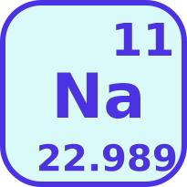

# sodium

    

**N**ested **a**liases for your shell.

## Supported shells

`na` supports all [cobra](https://github.com/spf13/cobra)-generated autocompletions:

* bash
* fish
* powershell
* zsh

## Reserved aliases

Below aliases cannot be used due to being [cobra](https://github.com/spf13/cobra) bultins:

* `completion`
* `help`
* `--help`
* `-h`

## License

MIT