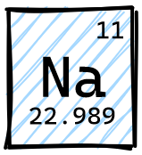

# sodium

<p align="center">
    
</p>

**N**ested **a**liases for your shell.

## TODO

* [ ] support for minimal form config
* [ ] test on powershell
* [ ] readme
* [ ] version
* [ ] debug logs

## Example

1. Set aliases in config file.
2. Generate autocompletions for your shell:

    * bash
    
        ```shell
        jaja
        ```
    
    * bash
    
        ```shell
        jaja
        ```

    * powershell
    
        ```shell
        jaja
        ```

    * fish

        ```shell
        jaja
        ```

        

## Config file schema

```yaml
ble ble
```

## Config file location

TBD

## Supported shells

`na` supports all [cobra](https://github.com/spf13/cobra)-generated autocompletions:

* bash
* fish
* powershell
* zsh

## Reserved aliases

Below aliases cannot be used due to being [cobra](https://github.com/spf13/cobra) bultins:

* `completion`
* `help`
* `--help`
* `-h`

## License

MIT